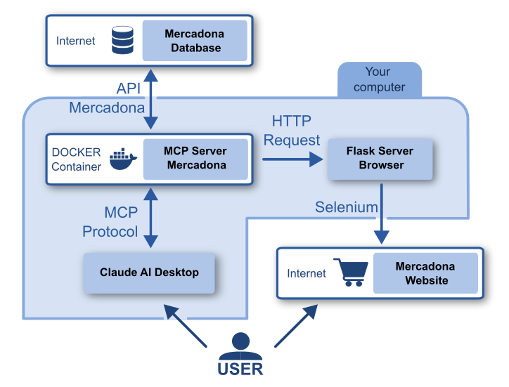

# Mercadona: Crea tu carrito en segundos, solo di qué quieres comer.

_English version below_

## Descripción

Este proyecto combina la inteligencia artificial de Claude AI[^1], con la plataforma de venta web de Mercadona[^2], permitiendo la selección e inclusión de productos en el carrito de la compra de forma inteligente y completamente automática.

¿Buscas una receta en particular? ¿Quieres hacer la compra de la semana? O, simplemente, ¿quieres comprar un producto en concreto?

**¡Pide a Claude AI que prepare tu carrito de la compra en Mercadona con lo que necesitas!**

Claude AI buscará aquel producto que quieres comprar o todos los ingredientes necesarios para tu receta o menú semanal y los incluirá en el carrito de la compra de Mercadona, dejándotelo todo listo para pagar. 

Te permitirá ahorrar tiempo y evitar olvidos al hacer tu lista de la compra, permitiéndote verificar el carrito de la compra antes de pagar.

⚠️ **_NOTA_** ⚠️ : Este proyecto es solo demostrativo, no busca ser para uso público y haría falta una integración real con la plataforma de Mercadona para un buen funcionamiento.  

## Demostración

## Detalles técnicos

El esquema general del proyecto es el siguiente: 

    

El usuario interactúa directamente con Claude AI Desktop. Cuando hace una pregunta que involucre a Mercadona, Claude AI tiene disponible varias herramientas a través del servidor MCP (Model Context Protocol)[^3]. Estas herramientas le permiten acceder a la base de datos de Mercadona, a través de la API desarrollada, o, si conoce los identificadores de los productos, añadirlos al carrito de la compra en la web de Mercadona.

Entre las funciones que permiten las herramientas se encuentran:
- Listar todas las categorías, subcategorías y tipos de productos en Mercadona.
- Buscar el producto más barato de una subcategoría o tipo determinado.
- Buscar un producto a partir del nombre.
- Enviar los productos al carrito de Mercadona.

La comunicación entre el servidor MCP y la base de datos de Mercadona se hace a través de la API cliente desarrollada en Python. Esta envía peticiones HTTP siguiendo los principios de REST a la API servidor de Mercadona. Las respuestas son procesadas antes de devolverlas a Claude AI para filtrar la información importante.

El MCP está dentro de un contenedor Docker para facilitar la portabilidad, integración con otros servicios y aislar las dependencias. 

Para poder abrir el navegador en la máquina host de forma sencilla (sin instalar X11 forwarding), se ha desarrollado un servidor fuera del contenedor que pueda tener acceso directo a la interfaz gráfica del ordenador. Este servidor (llamado _browser_) establece un puerto de escucha usando Flask para recibir peticiones HTTP entrantes. 

Cuando Claude AI decide crear el carrito de la compra en la web de Mercadona, envía una petición POST HTTP gracias al servidor MCP al servidor _browser_. Este servidor acepta como mensaje una lista de identificadores de productos. A continuación, decide si necesita abrir el navegador o no (ya está abierto) y abre la web de Mercadona cargando directamente los productos en el carrito de la compra. 

### Tecnologías utilizadas
- **Claude AI Desktop** : Modelo LLM seleccionado. Permite la integración de servidores MCP sin requerir versión de pago.
- **MCP Python SDK** : Para conectar Claude AI con Mercadona
- **Flask** : Para crear el servidor en Python.
- **Docker** : Para crear el contenedor del servidor MCP.
- **HTTP - REST** : Para las comunicaciones con la API de Mercadona y el servidor _browser_.
- **Selenium** : Para abrir el navegador, insertar cookies y datos en la web desde Python.
- **Python** : Lenguaje de programación utilizado.
- **Entornos virtuales** : Para aislar las dependencias del servidor _browser_.
- **Git** : Para el control de versiones.

## Estructura del proyecto

- **Carpeta principal**
    - **browser_app** : Contiene el servidor _browser_ que abre el navegador en el ordenador.
        - `browser.py` : Contiene la clase _browser_ que controla el navegador.
        - `requirements.txt` : Lista de dependencias necesarias para ejecutar el servidor.
        - `server.py` : Establece el servidor Flask, con puerto de escucha 8080.
    - **mcp_app** : Contiene el servidor MCP.
        - **src** : Tiene el código fuente del servidor MCP.
            - `api_mercadona.py` : Contiene funciones para comunicarse con la API servidor de Mercadona.
            - `mcp_server_mercadona.py` : Crea el propio servidor MCP y define las herramientas disponibles para el modelo de LLM.
            - `utils_products.py` : Contiene funciones para procesar listas de productos sin establecer conexión con la API.
        - `dockerignore` : Define los archivos ignorados por Docker.
        - `build_run.sh` : Script para construir y ejecutar el contenedor. Usado en fase de desarrollo.
        - `build.sh` : Script para construir el contenedor. Usado en fase de desarrollo.
        - `Dockerfile` : Contiene el conjunto de instrucciones para crear el contenedor Docker.
        - `requirements.txt` : Contiene la lista de dependencias Python del contenedor.
        - `secrets_template.json` : Archivo de ejemplo para definir los secretos. Copiar la estructura en un archivo llamado secrets.json e incluir las claves necesarias en él.

## Estado del proyecto

Como se mencionó anteriormente, no busca ser un proyecto para uso público, por lo tanto se considera como terminado si bien quedan muchas mejoras posibles. El objetivo es mostrar un proyecto completamente funcional que integre tecnologías de RAG (Retrieval-Augmented Generation) con Claude AI y API públicas.

## Instalación y uso

Para detalles sobre cómo instalar y usar el sistema, contacta conmigo por LinkedIn.

## Contacto

LinkedIn: [www.linkedin.com/in/carlos-alvarez-cia](http://www.linkedin.com/in/carlos-alvarez-cia)

## Referencias

[^1]: https://claude.ai
[^2]: https://www.mercadona.es
[^3]: https://modelcontextprotocol.io/introduction

# English Version

# Mercadona: Create your cart in seconds—just say what you want to eat.

## Description

This project combines the artificial intelligence of Claude AI[^1] with the online shopping platform of Mercadona[^2], enabling the intelligent and fully automated selection and inclusion of products in your shopping cart.

Looking for a specific recipe? Want to do your weekly grocery shopping? Or just need to buy a particular product?

**Ask Claude AI to prepare your Mercadona shopping cart with exactly what you need!**

Claude AI will search for the product you want to buy—or gather all the ingredients needed for your recipe or weekly menu—and include them in your Mercadona shopping cart, leaving everything ready for checkout.

It helps you save time and avoid forgetting anything from your shopping list, allowing you to review the cart before finalizing the purchase.

⚠️ **_NOTE_** ⚠️: This project is for demonstration purposes only. It is not intended for public use and would require real integration with Mercadona's platform for full operation.

## Demo

## Technical Details

The general architecture of the project is as follows:

    

The user interacts directly with Claude AI Desktop. When a request involving Mercadona is made, Claude AI has access to several tools via the MCP (Model Context Protocol) server[^3]. These tools allow access to Mercadona's database through the developed API, or—if the product IDs are known—directly add them to the cart on Mercadona's website.

The available tool functions include:

- Listing all categories, subcategories, and product types available in Mercadona.
- Searching for the cheapest product within a given subcategory or type.
- Searching for a product by name.
- Sending products to the Mercadona shopping cart.

Communication between the MCP server and the Mercadona database is done through the Python client API, which sends HTTP requests following REST principles to the Mercadona API server. The responses are processed to extract and return only the relevant information to Claude AI.

The MCP runs inside a Docker container to improve portability, integration with other services, and dependency isolation.

To easily open a browser on the host machine (without setting up X11 forwarding), a separate server was developed outside the container to access the host's graphical interface. This server (called _browser_) opens a listening port using Flask to receive incoming HTTP requests.

When Claude AI decides to create a shopping cart on the Mercadona website, it sends an HTTP POST request from the MCP server to the *browser* server. The server receives a list of product IDs, determines whether the browser needs to be opened, and then opens the Mercadona site with the selected products already in the cart.

### Technologies Used

- **Claude AI Desktop**: The selected LLM model. Allows MCP server integration without requiring a paid version.
- **MCP Python SDK**: To connect Claude AI with Mercadona.
- **Flask**: To create the server in Python.
- **Docker**: To containerize the MCP server.
- **HTTP - REST**: For communication with Mercadona's API and the _browser_ server.
- **Selenium**: To open the browser, insert cookies, and modify the site from Python.
- **Python**: Main programming language.
- **Virtual environments**: To isolate dependencies of the _browser_ server.
- **Git**: For version control.

## Project Structure

- **Main folder**

  - **browser_app**: Contains the *browser* server that controls the local browser.
    - `browser.py`: Contains the *browser* class that handles the browser logic.
    - `requirements.txt`: List of dependencies for running the server.
    - `server.py`: Sets up the Flask server, listening on port 8080.

  - **mcp_app**: Contains the MCP server.
    - **src**: Contains the MCP server’s source code.
      - `api_mercadona.py`: Functions to interact with Mercadona’s API server.
      - `mcp_server_mercadona.py`: Creates the MCP server and defines the tools available to the LLM.
      - `utils_products.py`: Contains utility functions to process product lists without calling the API.
    - `dockerignore`: Files to ignore when building the Docker image.
    - `build_run.sh`: Script to build and run the container (used during development).
    - `build.sh`: Script to build the container (used during development).
    - `Dockerfile`: Instructions to build the Docker container.
    - `requirements.txt`: List of Python dependencies for the container.
    - `secrets_template.json`: Template file to define secrets. Copy it to a new file named `secrets.json` and include your keys there.

## Project Status

As mentioned, this project is not intended for public use, so it is considered complete, although there is room for many improvements. The goal is to demonstrate a fully functional project integrating RAG (Retrieval-Augmented Generation) technologies with Claude AI and public APIs.

## Installation and Usage

For details on how to install and use the system, contact me via LinkedIn.

## Contact

LinkedIn: [www.linkedin.com/in/carlos-alvarez-cia](http://www.linkedin.com/in/carlos-alvarez-cia)

## References

[^1]: [https://claude.ai](https://claude.ai)

[^2]: [https://www.mercadona.es](https://www.mercadona.es)

[^3]: [https://modelcontextprotocol.io/introduction](https://modelcontextprotocol.io/introduction)

